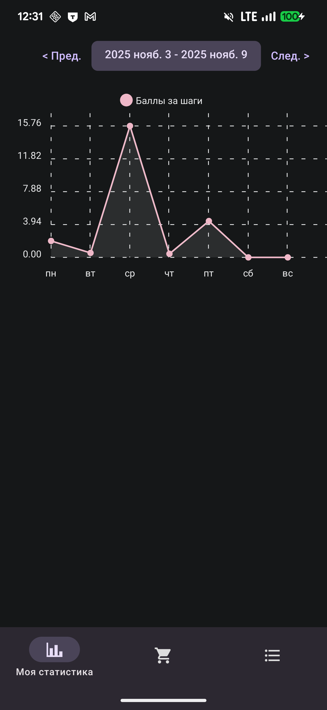
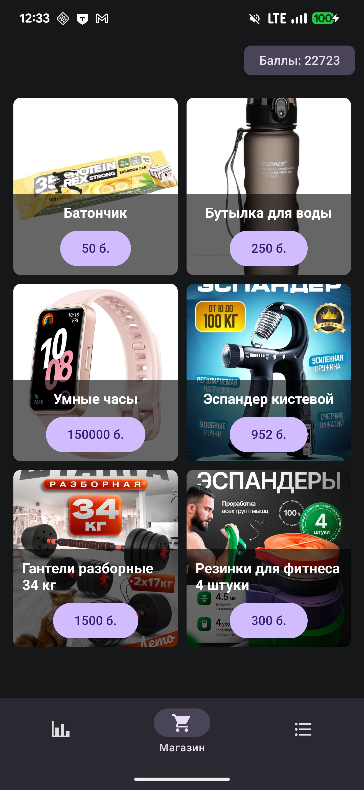
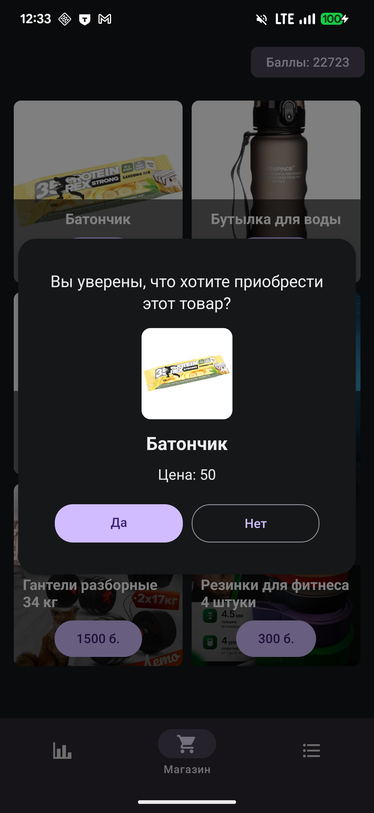
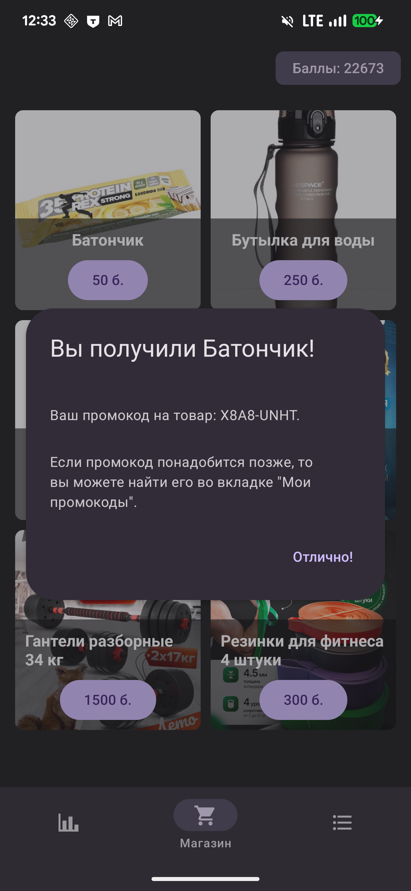
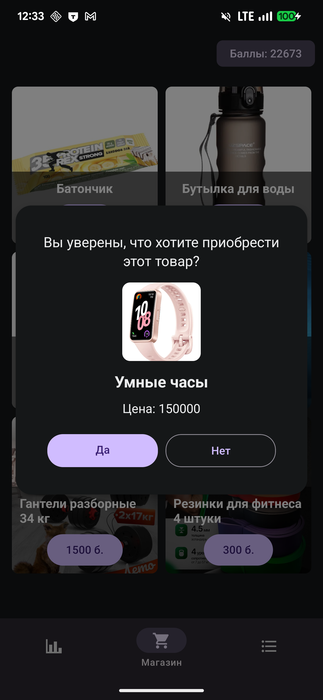
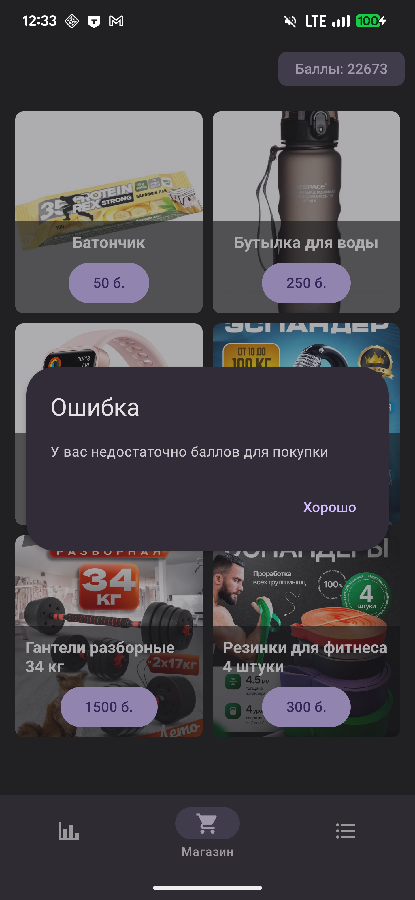
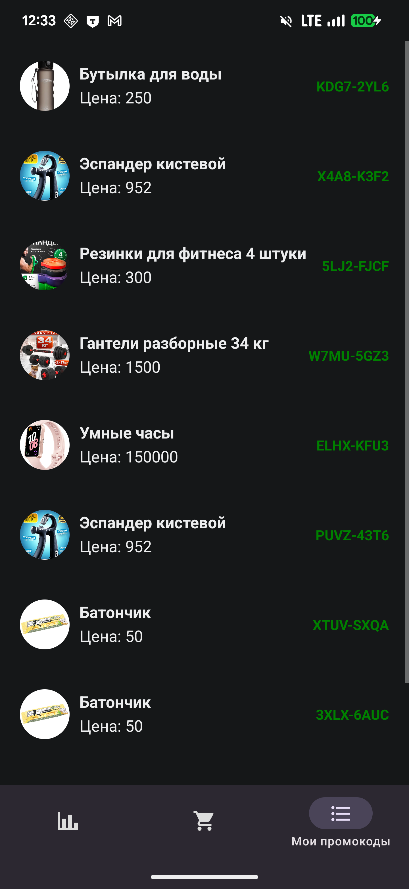

# HSE Key APP

Приложение для получения вознаграждения за активности в реальной жизни.
Получает данные о физической активности через Google Fit / Apple Fit.

## Скриншоты

    
    
    
    
    
    
    

## Скачать
Пока что можно только на Android

Вот тут - https://github.com/linuxfight/hsekey/releases/download/v1.0/fitboost.apk

## Что есть?
- Авторизация
- Получение статистики по бегу через Google Fit
- Отправка статистики и подсчёт баллов
- Покупка товаров за баллы

## Что будет добавлено ещё?
- Облачное сохранение промокодов (в истории транзакций)
- Настоящие промокоды вместо генерируемых (в веб панельке при добавлении промокодов можно будет ввести промокоды)
- Автообновление серверной части
- Подсчёт калорий через нейросеть
- Персональный ИИ тренер
- iOS-версия
- Веб панелька для партнёров (статистика по товарам, добавление товаров)
